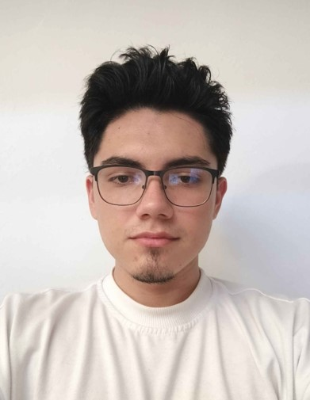
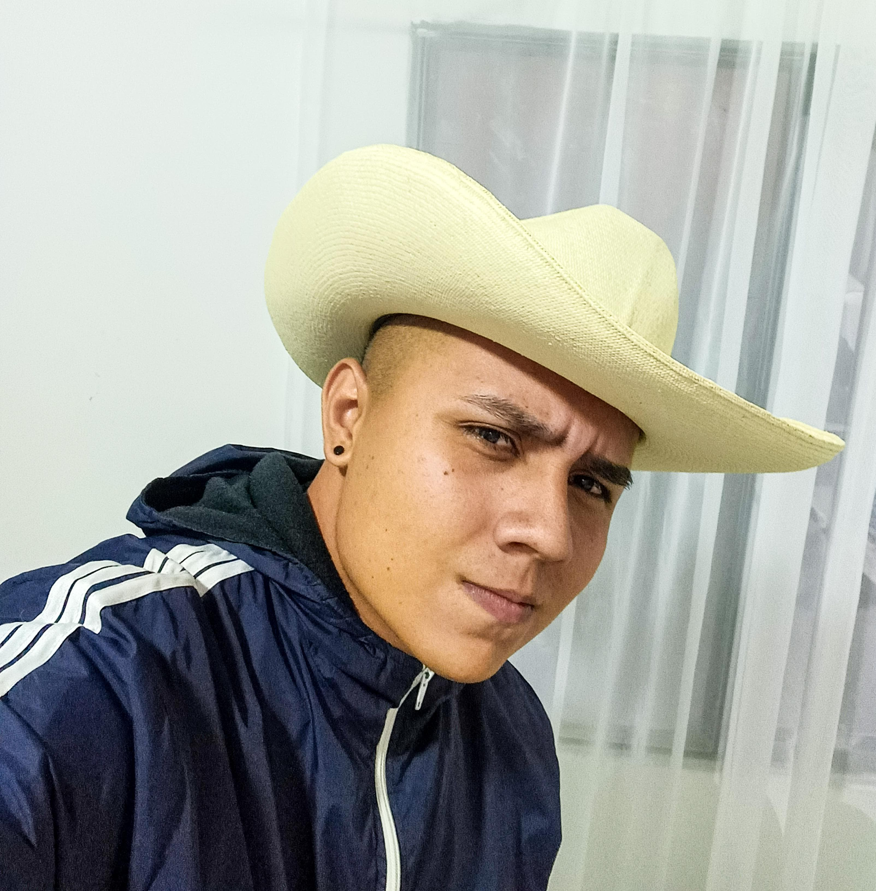
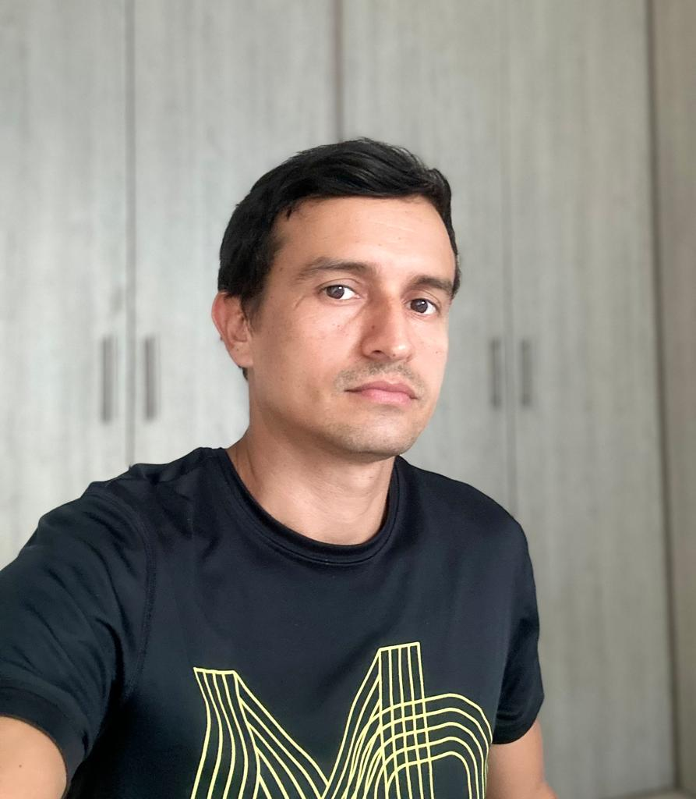
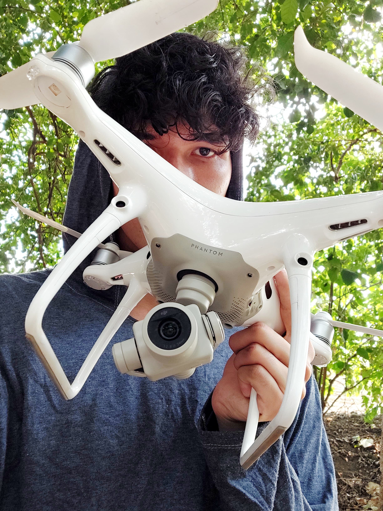

# Tiburones Implacables

Bienvenidos al repositorio de nuestro equipo "Tiburones Implacables". Este será el repositorio que usaremos para la materia "Programación para videojuegos". Conoce un poco de nosotros

## Miembros del Equipo

    
    

 <strong>Santiago Martínez Martínez</strong> 
        <strong>Rol en la Industria:</strong> Character Artist - Assets Artists 
        <strong>Ubicación:</strong> Medellín - Antioquia  
        <strong>Perfil:</strong>  
        
Estudiante de ingeniería multimedia, con experiencia en el uso de Angular para el desarrollo de aplicaciones web. Cuenta con habilidades avanzadas en modelado 3D y manejo de herramientas de diseño.

    

---

    
    

        <strong>Jorrge Enrique Sandoval Pacheco</strong> 
        <strong>Rol en la Industria:</strong> Game Artist 
        <strong>Ubicación:</strong> Pitalito - Huila   
        <strong>Perfil:</strong>  
        
Estudiante de ingeniería multimedia, con experiencia  en Diseño y creación de marca, diseño y desarrollo web, diseño gráfico de piezas publicitarias y campañas integrando Marketing Digital y envudos de venta.

    

---

    
    

        <strong>Mario Alejandro Trujillo CAmacho</strong> 
        <strong>Rol en la Industria:</strong> Level Designer 
        <strong>Ubicación:</strong> Guadalupe-Huila  
        <strong>Perfil:</strong>  
        
Estudiante de ingenieria multimedia, septimo semestre, con experiencias en desarrollo de aplicaciones y diseño de las mismas, trabajo como socialmedier, y organizo sus campañas de marketing

    

---

    
    

 <strong>José Leonardo Bustos</strong> 
        <strong>Rol en la Industria:</strong> Level Designer 
        <strong>Ubicación:</strong> Ibagué - Tolima  
        <strong>Perfil:</strong>  
        
Estudiante de ingeniería multimedia, con experiencia en edición y animación de video, así como en el desarrollo de aplicaciones móviles utilizando Flutter. Poseo habilidades en la creación de contenido visual.

    

---

    
    

        <strong>Nombre</strong> 
        <strong>Rol en la Industria:</strong> Game Programmer 
        <strong>Ubicación:</strong> Ibagué - Tolima  
        <strong>Perfil:</strong>  
        
Estudiante de 7 semestre de Ingenieria Multimedia en UNAD e Ingenieria Forestal en UT. Con experiencia en creación de paginas web, aplicativos en Adobe Animate, procesamiento de imagenes satelitales a travez de Python y asercamiento en R (muy poco). Considero que tengo vacios en programación y quisiera llenarlos, a la vez de realizar aplicaciones tanto para pc como para moviles. No soy muy bueno en la creación de contenido visual (Personajes, Escenarios etc...) 

    

    <strong>Grupo:</strong> 213027_13  
    <strong>Año:</strong> 2024  
    <strong>Universidad Nacional Abierta y a Distancia - UNAD</strong> 

